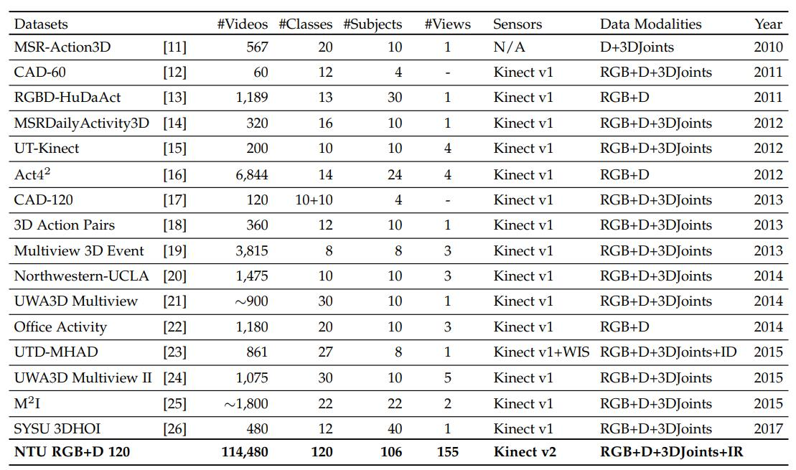

# Awesome-Skeleton-based-Action-Recognition <!-- omit in toc -->

If you have any problems, suggestions or improvements, please submit the issue or PR.

## TODO <!-- omit in toc -->

- [ ] Paper list
  - [x] supervised methods
  - [ ] semi-supervised methods
  - [ ] unsupervised methods
  - [ ] adversarial methods
- [ ] Leaderboard for supervised methods
  - [x] NTU RGB+D
  - [ ] NTU RGB+D 120
- [ ] Leaderboard for unsupervised and semi-supervised methods

## Contents <!-- omit in toc -->

- [Misc](#misc)
- [Datasets](#datasets)
- [Semi-supervised and Unsupervised Skeleton Rrepresentation](#semi-supervised-and-unsupervised-skeleton-rrepresentation)
  - [arXiv](#arxiv)
  - [papers](#papers)
- [Supervised Skeleton-based Action Recognition](#supervised-skeleton-based-action-recognition)
  - [arXiv papers](#arxiv-papers)
  - [Survey](#survey)
  - [2020](#2020)
  - [2019](#2019)
  - [2018](#2018)
  - [2017](#2017)
  - [before 2017](#before-2017)
- [LeaderBoard](#leaderboard)
  - [NTU-RGB+D](#ntu-rgbd)
  - [NTU-RGB+D 120](#ntu-rgbd-120)

## Misc

- Microsoft Kinect sensor and its effect (**IEEE Multimedia 2012**) [[paper](https://ieeexplore.ieee.org/document/6190806)]
- Other GITHUB Repos for Skeleton-based Action Recognition Papers
  - [<https://github.com/XiaoCode-er/Skeleton-Based-Action-Recognition-Papers>](https://github.com/XiaoCode-er/Skeleton-Based-Action-Recognition-Papers)
  - [<https://github.com/cagbal/Skeleton-Based-Action-Recognition-Papers-and-Notes>](https://github.com/cagbal/Skeleton-Based-Action-Recognition-Papers-and-Notes)
- [Quo Vadis, Skeleton Action Recognition?](https://skeleton.iiit.ac.in/) : A web portal as part on human action understanding from skeleton data. The
portal contains
  - (1) an interactive dashboard showing detailed performance plots of top performing models for NTU-120 dataset.
  - (2) code and pre-trained models for top-performers, including novel ensemble which achieves state-of-the-art performance on NTU-120
  - (3) new skeleton action datasets (skeletics-152, skeleton-mimetics) and pre-trained models.

## Datasets

- *(New! 2021)* **PoseC3D 2D Skeleton Dataset (FineGYM, NTURGB-D, Kinetics, Volleyball)** [[arxiv](https://arxiv.org/pdf/2104.13586.pdf), [Github](https://github.com/open-mmlab/mmaction2/tree/master/tools/data/skeleton)]
- *(New! 2021)* **NTU60-X Dataset** [[arxiv](https://arxiv.org/pdf/2101.11529.pdf), [Github](https://github.com/skelemoa/ntu-x)]
- *(New! 2019)* **NTU RGB+D 120 Dataset** [[Homepage](http://rose1.ntu.edu.sg/datasets/actionrecognition.asp),[Github](https://github.com/shahroudy/NTURGB-D)]
- NTU RGB+D Dataset [[Homepage](http://rose1.ntu.edu.sg/datasets/actionrecognition.asp),[Github](https://github.com/shahroudy/NTURGB-D)]
- (2018) VARYING-VIEW RGB-D ACTION DATASET [[arxiv](https://arxiv.org/pdf/1904.10681.pdf), [Github](https://github.com/HRI-UESTC/CFM-HRI-RGB-D-action-database)]
- (2017) SYSU 3D Human-Object Interaction Dataset (**SYSU**)
- (2015) UWA3D Multiview Activity II Dataset (**UWA3D**) [[download](http://staffhome.ecm.uwa.edu.au/~00053650/databases.html)]
- (2014) Northwestern-UCLA Dataset (**N-UCLA**) [[donwload](https://users.eecs.northwestern.edu/~jwa368/my_data.html)]
<!-- - SBU Kinect Interaction Dataset (**SBU**) -->

This section only shows some popular or new datasets, other available datasets for 3D action recognition and their statistics can be found in the following Table from the journal paper of **NTU RGB+D 120 Dataset** ([TPAMI](https://arxiv.org/pdf/1905.04757.pdf)).

## Semi-supervised and Unsupervised Skeleton Rrepresentation

### arXiv

- Augmented skeleton based contrastive action learning with momentum lstm for unsupervised action recognition [[arxiv](https://arxiv.org/abs/2008.00188)] [[Github](https://github.com/LZU-SIAT/AS-CAL)]
- Skeleton-DML: Deep Metric Learning for Skeleton-Based One-Shot Action Recognition [[arxiv](https://arxiv.org/abs/2012.13823)][[Github](https://github.com/raphaelmemmesheimer/skeleton-dml)]
- Sparse Semi-Supervised Action Recognition with Active Learning [[arxiv](https://arxiv.org/abs/2012.01740#:~:text=Sparse%20Semi%2DSupervised%20Action%20Recognition%20with%20Active%20Learning,-Jingyuan%20Li%2C%20Eli&text=Current%20state%2Dof%2Dthe%2D,in%20annotation%20and%20mislabeled%20data.)]
- 3D Human Action Representation Learning via Cross-View Consistency Pursuit (**CVPR 2021**)[[arxiv](https://arxiv.org/pdf/2104.14466.pdf)][[Github](https://github.com/LinguoLi/CrosSCLR)] 

### papers

- Adversarial Self-Supervised Learning for Semi-Supervised 3D Action Recognition (**ECCV 2020**) [[arxiv](https://arxiv.org/pdf/2007.05934.pdf)]
- Unsupervised 3D Human Pose Representation with Viewpoint and Pose Disentanglement (**ECCV 2020**) [[arxiv](https://arxiv.org/pdf/2007.07053.pdf)] [[Github](https://github.com/NIEQiang001/unsupervised-human-pose)]
- Predict & cluster: Unsupervised skeleton based action recognition (**CVPR 2020**) [[arxiv](https://arxiv.org/pdf/1911.12409.pdf)] [[Github](https://github.com/shlizee/Predict-Cluster)]
- Ms2l: Multi-task self-supervised learning for skeleton based action recognition (**ACMMM 2020**) [[arxiv](https://arxiv.org/pdf/2010.05599.pdf)]
- Unsupervised feature learning of human actions as trajectories in pose embedding manifold (**WACV 2018**) [[arxiv](https://arxiv.org/abs/1812.02592)]
- Unsupervised representation learning with long-term dynamics for skeleton based action recognition (**AAAI 2018**) [[arxiv](https://www.aaai.org/ocs/index.php/AAAI/AAAI18/paper/viewFile/16341/15984)] [[Github](https://github.com/jungel2star/Unsupervised-Representation-Learning-with-Long-Term-Dynamics-for-Skeleton-Based-Action-Recognition)]

## Skeleton-based Action Recognition under Adversarial Attack

- Understanding the Robustness of Skeleton-based Action Recognition under Adversarial Attack (**CVPR 2021**) [[arxiv](https://arxiv.org/pdf/2103.05347.pdf)]
- BASAR:Black-box Attack on Skeletal Action Recognition (**CVPR 2021**) [[arxiv](https://arxiv.org/pdf/2103.05266.pdf)]

## Supervised Skeleton-based Action Recognition

### arXiv papers

This section only includes the last five papers since 2018 in [arXiv.org](arXiv.org). Note that arXiv papers **without available codes** are not included in [the leaderboard of performance](#leaderboard).

- **[Sym-GNN]** Symbiotic Graph Neural Networks for 3D Skeleton-based Human Action Recognition and Motion Prediction [[arxiv](https://arxiv.org/pdf/1910.02212v1.pdf)] [[Github](https://github.com/limaosen0/Sym-GNN)]
- **[DenseIndRNN]** Deep Independently Recurrent Neural Network (**Preprint**) [[arxiv](https://arxiv.org/pdf/1910.06251v1.pdf)] [[Github](https://github.com/Sunnydreamrain/IndRNN_pytorch)]
- Optimized Skeleton-based Action Recognition via Sparsified Graph Regression [[arxiv](https://arxiv.org/pdf/1811.12013.pdf)]
- Skeleton-Based Action Recognition with Synchronous Local and Non-local Spatio-temporal Learning and Frequency Attention [[arxiv](https://arxiv.org/pdf/1811.04237.pdf)]
- **[DSTA-Net]** Decoupled Spatial-Temporal Attention Network for Skeleton-Based Action Recognition [[arxiv](https://arxiv.org/abs/2007.03263#:~:text=Decoupled%20Spatial%2DTemporal%20Attention%20Network%20for%20Skeleton%2DBased%20Action%20Recognition,-Lei%20Shi%2C%20Yifan&text=It%20involves%20solely%20the%20attention,their%20positions%20or%20mutual%20connections.)]
- Skeleton-Based Action Recognition with Multi-Stream Adaptive Graph Convolutional Networks [[arxiv](https://arxiv.org/pdf/1912.06971.pdf)]
- Quo Vadis, Skeleton Action Recognition ? [[arxiv](https://128.84.21.199/pdf/2007.02072.pdf)] [[Github](https://github.com/skelemoa/quovadis)]
- SynSE: Syntactically Guided Generative Embeddings for Zero Shot Skeleton Action Recognition [[arxiv](https://arxiv.org/pdf/2101.11530.pdf)] [[Github](https://github.com/skelemoa/synse-zsl)]
- **[PoseC3D]** Revisiting Skeleton-based Action Recognition [[arxiv](https://arxiv.org/pdf/2104.13586.pdf)][[Github](https://github.com/open-mmlab/mmaction2/tree/master/configs/skeleton/posec3d)]
- Leveraging Third-Order Features in Skeleton-Based Action Recognition [[arxiv](https://arxiv.org/pdf/2105.01563.pdf)][[Github](https://github.com/ZhenyueQin/Angular-Skeleton-Encoding)] [[Github](https://github.com/ZhenyueQin/Angular-Skeleton-Encoding)]

### Survey

- A Comparative Review of Recent Kinect-based Action Recognition Algorithms (***TIP 2019***) [[arxiv](https://arxiv.org/pdf/1906.09955.pdf)]

### 2021

- **[MMDGCN]** Multi-scale Mixed Dense Graph Convolution Network for Skeleton-based Action Recognition (**IEEE Access**) [[paper](https://ieeexplore.ieee.org/stamp/stamp.jsp?tp=&arnumber=9312608)]
- Quo Vadis, Skeleton Action Recognition ? [[paper](https://arxiv.org/pdf/2007.02072.pdf)] [[Github](https://github.com/skelemoa/quovadis)] (**IJCV**)

### 2020

- **[MV-IGNET]** Learning Multi-View Interactional Skeleton Graph for Action Recognition (**TPAMI 2020**) [[paper](https://ieeexplore.ieee.org/abstract/document/9234715)][[Github](https://github.com/niais/mv-ignet)]
- **[P&C FW-AEC]** PREDICT & CLUSTER: Unsupervised Skeleton Based Action Recognition (**CVPR 2020**) [[paper](http://openaccess.thecvf.com/content_CVPR_2020/papers/Su_PREDICT__CLUSTER_Unsupervised_Skeleton_Based_Action_Recognition_CVPR_2020_paper.pdf)]
- **[CA-GC]** Context Aware Graph Convolution for Skeleton-Based Action Recognition (**CVPR 2020**) [[paper](http://openaccess.thecvf.com/content_CVPR_2020/papers/Zhang_Context_Aware_Graph_Convolution_for_Skeleton-Based_Action_Recognition_CVPR_2020_paper.pdf)]
- **[Shift-GCN]** Skeleton-Based Action Recognition With Shift Graph Convolutional Network (**CVPR 2020**) [[paper](http://openaccess.thecvf.com/content_CVPR_2020/papers/Cheng_Skeleton-Based_Action_Recognition_With_Shift_Graph_Convolutional_Network_CVPR_2020_paper.pdf)][[Github](https://github.com/kchengiva/Shift-GCN)]
- **[DMGNN]** Dynamic Multiscale Graph Neural Networks for 3D Skeleton Based Human Motion Prediction (**CVPR 2020**) [[paper](http://openaccess.thecvf.com/content_CVPR_2020/papers/Li_Dynamic_Multiscale_Graph_Neural_Networks_for_3D_Skeleton_Based_Human_CVPR_2020_paper.pdf)]
- **[SGN]** Semantics-Guided Neural Networks for Efficient Skeleton-Based Human Action Recognition (**CVPR 2020**) [[arxiv](https://arxiv.org/pdf/1904.01189.pdf)][[Github](https://github.com/microsoft/SGN)]
- **[MS-G3D]** Disentangling and Unifying Graph Convolutions for Skeleton-Based Action Recognition (**CVPR 2020**) [[arxiv](https://arxiv.org/pdf/2003.14111.pdf)] [[Github](https://github.com/kenziyuliu/ms-g3d)]
- **[Dynamic GCN]** Dynamic GCN: Context-enriched Topology Learning for Skeleton-based Action Recognition (**ACM-MM 2020**)[[arxiv](https://arxiv.org/pdf/2007.14690.pdf)]

- **[GCN-NAS]** Learning Graph Convolutional Network for Skeleton-based Human Action Recognition by Neural Searching (**AAAI 2020**) [[arxiv](https://arxiv.org/pdf/1911.04131v1.pdf)] [[Github](https://github.com/xiaoiker/GCN-NAS)]

- **[DecoupleGCN-DropGraph]** Decoupling GCN with DropGraph Module for Skeleton-Based Action Recognition (**ECCV 2020**) [[arxiv](http://www.ecva.net/papers/eccv_2020/papers_ECCV/papers/123690528.pdf)] [[Github](https://github.com/kchengiva/DecoupleGCN-DropGraph)]
- **[PA-ResGCN]** Stronger, Faster and More Explainable: A Graph Convolutional Baseline for Skeleton-based Action Recognition (**ACM-MM 2020**) [[arxiv](https://arxiv.org/pdf/2010.09978.pdf)] [[Github](https://github.com/yfsong0709/ResGCNv1)]
- **[Poincare-GCN]** Mix Dimension in Poincaré Geometry for 3D Skeleton-based Action Recognition (**ACM-MM 2020**) [[arxiv](https://arxiv.org/pdf/2007.15678.pdf)]
- **[STIGCN]** Spatio-Temporal Inception Graph Convolutional for Skeleton-Based Action Recognition (**ACM-MM 2020**) [[arxiv](https://dl.acm.org/doi/pdf/10.1145/3394171.3413666)]
- **[JOLO-GCN]** JOLO-GCN: Mining Joint-Centered Light-Weight Information for Skeleton-Based Action Recognition (**WACV 2021**) [[arxiv](https://arxiv.org/abs/2011.07787)]
- **[ST-TR-AGCN]** Spatial Temporal Transformer Network for Skeleton-based Action Recognition (**Under submission at Computer Vision and Image Understanding (CVIU)**) [[arxiv](https://arxiv.org/pdf/2008.07404.pdf)] [[Github](https://github.com/Chiaraplizz/ST-TR)]
- **[PCRP]** Prototypical Contrast and Reverse Prediction: Unsupervised Skeleton Based Action Recognition [[arxiv](https://arxiv.org/pdf/2011.07236.pdf)] [[Github](https://github.com/Mikexu007/PCRP)]

### 2019

- NTU-RGB+D 120: A Large-Scale Benchmark for 3D Human Activity Understanding (***TPAMI 2019***) [[arxiv](https://arxiv.org/pdf/1905.04757.pdf)] [[Homepage](http://rose1.ntu.edu.sg/datasets/actionrecognition.asp)] [[Github](https://github.com/shahroudy/NTURGB-D)]
- **[VA-NN]** View Adaptive Neural Networks for High Performance Skeleton-based Human Action Recognition (**TPAMI 2019**) [[arxiv](https://arxiv.org/pdf/1804.07453.pdf)] [[Github](https://github.com/microsoft/View-Adaptive-Neural-Networks-for-Skeleton-based-Human-Action-Recognition)]
- Bayesian Graph Convolutional LSTM for Skeleton Based Action Recognition (**ICCV 2019**) [[arxiv](http://openaccess.thecvf.com/content_ICCV_2019/papers/Zhao_Bayesian_Graph_Convolution_LSTM_for_Skeleton_Based_Action_Recognition_ICCV_2019_paper.pdf)]
- **[2s-SDGCN]** Spatial Residual Layer and Dense Connection Block Enhanced Spatial Temporal Graph Convolutional Network for Skeleton-Based Action Recognition (*ICCV Workshop 2019*) [[paper](http://openaccess.thecvf.com/content_ICCVW_2019/papers/SGRL/Wu_Spatial_Residual_Layer_and_Dense_Connection_Block_Enhanced_Spatial_Temporal_ICCVW_2019_paper.pdf)]
- **[DGNN]** Skeleton-Based Action Recognition With Directed Graph Neural Networks (**CVPR 2019**) [[paper](http://openaccess.thecvf.com/content_CVPR_2019/papers/Shi_Skeleton-Based_Action_Recognition_With_Directed_Graph_Neural_Networks_CVPR_2019_paper.pdf)] [[unofficial PyTorch implementation](https://github.com/kenziyuliu/DGNN-PyTorch)]
- **[2s-AGCN]** Two-Stream Adaptive Graph Convolutional Networks for Skeleton-Based Action Recognition (**CVPR 2019**) [[paper](http://openaccess.thecvf.com/content_CVPR_2019/papers/Shi_Two-Stream_Adaptive_Graph_Convolutional_Networks_for_Skeleton-Based_Action_Recognition_CVPR_2019_paper.pdf)] [[Github](https://github.com/lshiwjx/2s-AGCN)]
- **[AS-GCN]** Actional-Structural Graph Convolutional Networks for Skeleton-based Action Recognition (**CVPR 2019**) [[arxiv](https://arxiv.org/pdf/1904.12659.pdf)] [[Github](https://github.com/limaosen0/AS-GCN)]
- **[AGC-LSTM]** An Attention Enhanced Graph Convolutional LSTM Network for Skeleton-Based Action Recognition (**CVPR 2019**) [[arxiv](https://arxiv.org/pdf/1902.09130.pdf)]
- **[Motif-STGCN]** Graph CNNs with Motif and Variable Temporal Block for Skeleton-based Action Recognition (**AAAI 2019**) [[arxiv](http://geometrylearning.com/paper/Graph_CNN.pdf)] [[Github](https://github.com/wenyh1616/motif-stgcn)]
- Richly Activated Graph Convolutional Network for Action Recognition with Incomplete Skeletons (**ICIP 2019**) [[arxiv](https://arxiv.org/pdf/1905.06774.pdf)] [[Github](https://github.com/yfsong0709/RA-GCNv1)]
- **[TSRJI]** Skeleton Image Representation for 3D Action Recognition based on Tree Structure and Reference Joints (**SIBGRAPI**) [[arxiv](https://arxiv.org/pdf/1909.05704v1.pdf)] [[Github](https://github.com/carloscaetano/skeleton-images#skeleton-images-representation-SkeleMotion-and-SRJI)]
- **[SkeleMotion]** SkeleMotion: A New Representation of Skeleton Joint Sequences Based on Motion Information for 3D Action Recognition (**AVSS**) [[arxiv](https://arxiv.org/pdf/1907.13025v1.pdf)] [[Github](https://github.com/carloscaetano/skeleton-images#skeleton-images-representation-SkeleMotion-and-SRJI)]

### 2018

- **Beyond Joints:** Learning Representations from Primitive Geometries for Skeleton-based Action Recognition and Detection (***TIP 2018***) [[paper](https://ieeexplore.ieee.org/document/8360391)] [[Github](https://github.com/hongsong-wang/Beyond-Joints)]
- **[DPRL]** Deep progressive reinforcement learning for skeleton-based action recognition (**CVPR 2018**) [[paper](http://openaccess.thecvf.com/content_cvpr_2018/papers/Tang_Deep_Progressive_Reinforcement_CVPR_2018_paper.pdf)]
- **[SR-TSL]** Skeleton based action recognition with spatial reasoning and temporal stack learning (**ECCV 2018**) [[arxiv](https://arxiv.org/pdf/1805.02335.pdf)]
- **[HCN]** Co-occurrence feature learning from skeleton data for action recognition and detection with hierarchical aggregation (**IJCAI 2018**) [[arxiv](https://arxiv.org/pdf/1804.06055.pdf)] [[Reimplementation](https://github.com/huguyuehuhu/HCN-pytorch)]
- **[MAN]** Memory attention networks for skeleton-based action recognition (**IJCAI 2018**) [[arxiv](https://arxiv.org/pdf/1804.08254.pdf)] [[Github](https://github.com/memory-attention-networks/MANs)]
- **[ST-GCN]** Spatial temporal graph convolutional networks for skeleton-based action recognition (**AAAI 2018**) [[arxiv](https://arxiv.org/pdf/1801.07455.pdf)] [[Github](https://github.com/yysijie/st-gcn)]
- Spatio-temporal graph convolution for skeleton based action recognition (**AAAI 2018**) [[arxiv](https://arxiv.org/pdf/1802.09834.pdf)]
- Part-based Graph Convolutional Network for Action Recognition (**BMVC 2018**) [[arxiv](https://arxiv.org/pdf/1809.04983.pdf)] [[Github](https://github.com/kalpitthakkar/pb-gcn)]
- A Fine-to-Coarse Convolutional Neural Network for 3D Human Action Recognition (**BMVC 2018**) [[arxiv](https://arxiv.org/pdf/1805.11790.pdf)]
- A Large-scale Varying-view RGB-D Action Dataset for Arbitrary-view Human Action Recognition (**ACMMM 2018**) [[arxiv](https://arxiv.org/pdf/1904.10681.pdf)]

### 2017

- Jointly learning heterogeneous features for RGB-D activity recognition (***TPAMI 2017***) [[paper](https://www.cv-foundation.org/openaccess/content_cvpr_2015/papers/Hu_Jointly_Learning_Heterogeneous_2015_CVPR_paper.pdf)]
- **[Visualization CNN]** Enhanced skeleton visualization for view invariant human action recognition (***Pattern Recognition 2017***) [[paper](https://www.utdallas.edu/~cxc123730/PR_2017.pdf)]
- Global context-aware attention lstm networks for 3d action recognition (**CVPR 2017**) [[paper](https://ieeexplore.ieee.org/document/8099874)]
- **[Two-stream RNN]** Modeling temporal dynamics and spatial configurations of actions using two-stream recurrent neural networks (**CVPR 2017**) [[arxiv](https://arxiv.org/pdf/1704.02581.pdf)] [[Github](https://github.com/hongsong-wang/RNN-for-skeletons)]
- **[C-CNN + MTLN]** A new representation of skeleton sequences for 3d action recognition (**CVPR 2017**) [[arxiv](https://arxiv.org/pdf/1703.03492.pdf)]
- **[Ensemble TS-LSTM]** Ensemble deep learning for skeleton-based action recognition using temporal sliding lstm networks (**ICCV 2017**) [[paper](http://openaccess.thecvf.com/content_ICCV_2017/papers/Lee_Ensemble_Deep_Learning_ICCV_2017_paper.pdf)] [[Github](https://github.com/InwoongLee/TS-LSTM)]
- **[VA-LSTM]** View adaptive recurrent neural networks for high performance human action recognition from skeleton data (**ICCV 2017**) [[arxiv](https://arxiv.org/pdf/1703.08274.pdf)]
- Learning action recognition model from depth and skeleton videos (**ICCV 2017**) [[paper](https://ieeexplore.ieee.org/document/8237883)]
- **[STA-LSTM]** An end-to-end spatio-temporal attention model for human action recognition from skeleton data (**AAAI 2017**) [[arxiv](https://arxiv.org/pdf/1611.06067.pdf)]
- Skeleton-based action recognition using LSTM and CNN (*ICME Workshop 2017*) [[arxiv](https://arxiv.org/pdf/1707.02356.pdf)]
- Skeleton-based action recognition with convolutional neural networks (*ICME Workshop 2017*) [[arxiv](https://arxiv.org/pdf/1704.07595.pdf)]
- PKU-MMD: A large scale benchmark for continuous multi-modal human action understanding (*ACMMM Workshop 2017*) [[arxiv](https://arxiv.org/pdf/1703.07475.pdf)]
- **[Temporal Conv]** Interpretable 3d human action analysis with temporal convolutional networks (*CVPR Workshop 2017*) [[arxiv](https://arxiv.org/pdf/1704.04516.pdf)]

### before 2017

- **[Trust Gate ST-LSTM]** Spatio-temporal lstm with trust gates for 3d human action recognition (**ECCV 2016**) [[arxiv](https://arxiv.org/pdf/1607.07043.pdf)] [[Github](https://github.com/kinect59/Spatio-Temporal-LSTM)]
- **[Part-aware LSTM]** NTU RGB+D: A Large Scale Dataset for 3D Human Activity Analysis (**CVPR 2016**) [[arxiv](https://arxiv.org/pdf/1604.02808.pdf)]
- Rolling rotations for recognizing human actions from 3d skeletal data (**CVPR 2016**) [[paper](https://ieeexplore.ieee.org/document/7780853)]
- Co-occurrence feature learning for skeleton based action recognition using regularized deep lstm networks (**AAAI 2016**) [[paper](https://www.aaai.org/ocs/index.php/AAAI/AAAI16/paper/download/11989/12149)]
- Skeleton based action recognition with convolutional neural network (**ACPR 2015**) [[paper](https://ieeexplore.ieee.org/abstract/document/7486569)]
- **[H-RNN]** Hierarchical recurrent neural network for skeleton based action recognition (**CVPR 2015**) [[paper](https://ieeexplore.ieee.org/document/7298714)]
- Jointly learning heterogeneous features for rgb-d activity recognition (**CVPR 2015**) [[paper](https://www.cv-foundation.org/openaccess/content_cvpr_2015/papers/Hu_Jointly_Learning_Heterogeneous_2015_CVPR_paper.pdf)]
- **[LieGroup]** Human action recognition by representing 3d skeletons as points in a lie group (**CVPR 2014**) [[paper](https://openaccess.thecvf.com/content_cvpr_2014/papers/Vemulapalli_Human_Action_Recognition_2014_CVPR_paper.pdf)]
- Human action recognition using a temporal hierarchy of covariance descriptors on 3d joint locations (**IJCAI 2013**) [[paper](http://citeseerx.ist.psu.edu/viewdoc/download?doi=10.1.1.415.8032&rep=rep1&type=pdf)]

## LeaderBoard

The section is being continually updated. We only show results on large-scale dataset NTU-RGB+D and NTU-RGB+D 120.

### NTU-RGB+D

| Year | Methods               | Cross-Subject | Cross-View |
| ---- | --------------------- | :-----------: | :--------: |
| 2014 | Lie Group             |     50.1      |    52.8    |
| 2015 | H-RNN                 |     59.1      |    64.0    |
| 2016 | Part-aware LSTM       |     62.9      |    70.3    |
| 2016 | Trust Gate ST-LSTM    |     69.2      |    77.7    |
| 2017 | Two-stream RNN        |     71.3      |    79.5    |
| 2017 | STA-LSTM              |     73.4      |    81.2    |
| 2017 | Ensemble TS-LSTM      |     74.6      |    81.3    |
| 2017 | Visualization CNN     |     76.0      |    82.6    |
| 2017 | C-CNN + MTLN          |     79.6      |    84.8    |
| 2017 | Temporal Conv         |     74.3      |    83.1    |
| 2017 | VA-LSTM               |     79.4      |    87.6    |
| 2018 | Beyond Joints         |     79.5      |    87.6    |
| 2018 | ST-GCN                |     81.5      |    88.3    |
| 2018 | DPRL                  |     83.5      |    89.8    |
| 2019 | Motif-STGCN           |     84.2      |    90.2    |
| 2018 | HCN                   |     86.5      |    91.1    |
| 2018 | SR-TSL                |     84.8      |    92.4    |
| 2018 | MAN                   |     82.7      |    93.2    |
| 2019 | RA-GCN                |     85.9      |    93.5    |
| 2019 | DenseIndRNN           |     86.7      |    93.7    |
| 2018 | PB-GCN                |     87.5      |    93.2    |
| 2019 | AS-GCN                |     86.8      |    94.2    |
| 2019 | VA-NN (fusion)        |     89.4      |    95.0    |
| 2019 | AGC-LSTM (Joint&Part) |     89.2      |    95.0    |
| 2019 | 2s-AGCN               |     88.5      |    95.1    |
| 2020 | SGN                   |     89.0      |    94.5    |
| 2020 | GCN-NAS               |     89.4      |    95.7    |
| 2019 | 2s-SDGCN              |     89.6      |    95.7    |
| 2019 | DGNN                  |     89.9      |    96.1    |
| 2020 | MV-IGNET              |     89.2      |    96.3    |
| 2020 | 4s Shift-GCN          |     90.7      |    96.5    |
| 2020 | DecoupleGCN-DropGraph |     90.8      |    96.6    |  
| 2020 | PA-ResGCN-B19         |     90.9      |    96.0    |
| 2020 | MS-G3D                |     91.5      |    96.2    |

### NTU-RGB+D 120

Most of existing methods have not been tested on this new dataset yet, and some results can be found in the paper of **NTU RGB+D 120 Dataset** ([TPAMI](https://arxiv.org/pdf/1905.04757.pdf)).

| Year | Methods                             | Cross-Subject | Cross-Setup |
| ---- | ----------------------------------- | :-----------: | :---------: |
| 2019 | SkeleMotion (Magnitude-Orientation) |     62.9      |    63.0     |
| 2019 | SkeleMotion + Yang *et al*          |     67.7      |    66.9     |
| 2019 | TSRJI                               |     67.9      |    59.7     |
| 2020 | SGN                                 |     79.2      |    81.5     |
| 2020 | MV-IGNET                            |     83.9      |    85.6     |
| 2020 | 4s Shift-GCN                        |     85.9      |    87.6     |
| 2020 | DecoupleGCN-DropGraph               |     86.5      |    88.1     |
| 2020 | MS-G3D                              |     86.9      |    88.4     |
| 2020 | PA-ResGCN-B19                       |     87.3      |    88.3     |
